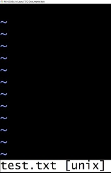

***01-4 vim 편집기***
# vim 편집기에서 텍스트 문서 만들기⭐

***vim이란***
- 터미널에서 사용할 수 있는 편집기 중에 대표적인 것이 리눅스의 기본 편집기인 vim이다.
- Git의 기능을 배우고 익히는 데 집중하기 위해 복잡하고 긴 소스 코드 대신에 간단한 텍스트가 담긴 파일로 실습

***vim에서 문서 작성, 저장***
1. Documents 디렉토리로 이동한 후 test 디렉토리를 생성, 해당 디렉토리로 이동
```bash
$ cd documents
$ mkdir test
$ cd test
```
2. test.txt 파일을 생성, 같은 파일이 없다면 그 이름으로 만들고 같은 파일이 있다면 그 파일을 연다.
```bash
$ vim test.txt
```
- 마크 다운에서 이미지 넣기
```

```                                            


3. vim에는 문서를 작성하는 '입력 모드'와 문서를 저장하는 'ex 모드'가 있다. vim은 처음에 'ex 모드'로 열린다.
4. vim 편집기에서 텍스트를 입력하려면 ex 모드 상태에서 I 또는 A를 눌러서 입력 모드 상태로 진입해야 한다. 입력 모드 상태가 되면 화면 맨 아래 'INSERT'가 화면에 출력된다.
5. 파일을 저장하려면 다시 ex모드로 전환해야 한다. 입력 모드에서 esc를 누르면 ex모드로 전환된다. 이 후 :wq 명령을 입력한 후 Enter를 입력한다. ':wq'는 저장 후 종료라는 의미이다.
6. Enter를 누르면 작성한 파일이 저장되고 편집기가 종료되면서 터미널 창으로 되돌아간다.

**vim의 ex모드 명령어**
명령|설명
---|---
:w 또는 :write| 편집하던 문서를 저장
:q 또는 :quit| 편집기를 종료
:wq| 편집하던 문서를 저장하고 종료
:q!| 편집하던 문서를 저장하지 않고 편집기를 종료, 확장가가 .swp인 임시 파일이 생성
:wq 파일명| 편집하던 문서를 지정한 파일 이름으로 저장

**cat 명령으로 텍스트 문서 확인하기**
- 터미널 창에서 텍스트 문서의 내용을 간단히 확인할 때는 리눅스의 cat명령을 사용. cat 명령 다음에 텍스트 파일 이름을 함께 사용하면 파일 내용을 출력
```bash
$ cat test.txt
```

**cat 명령 모음**
명령|기능
---|---
$ cat file| file의 내용을 화면에 표시
$ cat file(s) > NewFile| file(s)를 차례로 연결해서 새로운 파일인 NewFile을 생성
$ cat file1 >> file2| file1의 내용을 file2의 내용 끝에 연결


