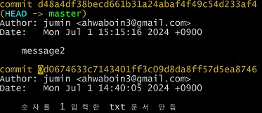

***02-3 커밋 내용 확인하기***
# 02-3 커밋 내용 확인하기

**커밋 기록 자세히 살펴보기**

- git log 명령을 입력하면 지금까지 만든 버전이 화면에 출력되고 버전마다 설명도 함께 출력된다.



- commit이라는 항목 옆에 영문과 숫자로 된 긴 문자열이 출력되는데 이것을 커밋 해시(commit hash) 또는 깃 해시(git hash)라고 한다. 커밋을 구별하는 아이디라 생각하면 된다.

- 커밋 해시 옆에 있는 (HEAD -> main(master))는 이 버전이 가장 최신이라는 의미이다.
- author 항목에는 버전을 누가 만들었는지, Date 항목에는 버전이 언제 만들어졌는지를 의미한다. 그 아래에는 작성자가 기록한 커밋 메시지가 출력된다.
- git log 명령을 입력했을 때 나오는 정보를 묶어 간단히 commit log라 한다.

**변경 사항 확인하기 - git diff**
- git diff명령을 사용하면 작업 트리에 있는 파일과 스테이지에 있는 파일을 비교하거나, 스테이지에 있는 파일과 저장소에 있는 최신 커밋을 비교해서 수정한 파일을 커밋하기 전에 최종 검토할 수 있다.

1. vim에서 hello.txt 파일을 열고 기존 내용 중에서 world를 지우고 everyone을 추가한 후 저장
```
$vim hello.txt
```
2. git status 명령을 사용해 git의 상태를 확인해보면 hello.txt 파일이 수정되었고, 아직 스테이징 상태가 아니라는 정보가 출력

3. 수정한 hello.txt 파일이 저장소에 최신 버전의 hello.txt와 어떻게 다른지 확인해 보기 위해 git diff 명령을 사용한다.

4. -world는 최신 버전과 비교할 때 hello.txt 파일에서 2가 삭제되었다는 의미이고, +everyone은 hello.txt 파일에 'everyone' 내용이 추가되었는 것을 의미한다. 이렇게 작업 트리에서 수정한 파일과 최신 버전을 비교한 후 수정한 내용으로 다시 버전을 만들려면 스테이지에 올린 후 커밋하고, 수정한 내용을 버리려면 git restore 명령을 사용해 취소한다.

5. vim에서 hello.txt 파일을 열고 everyone 부분을 world로 저장한다.


